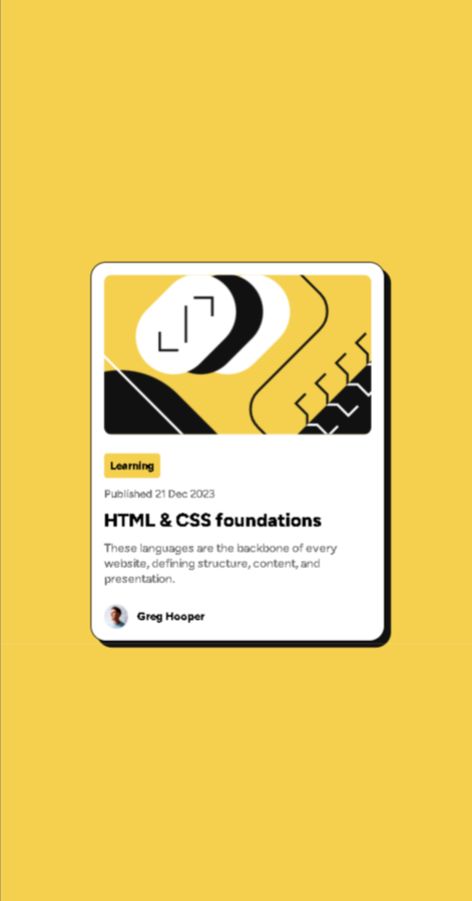
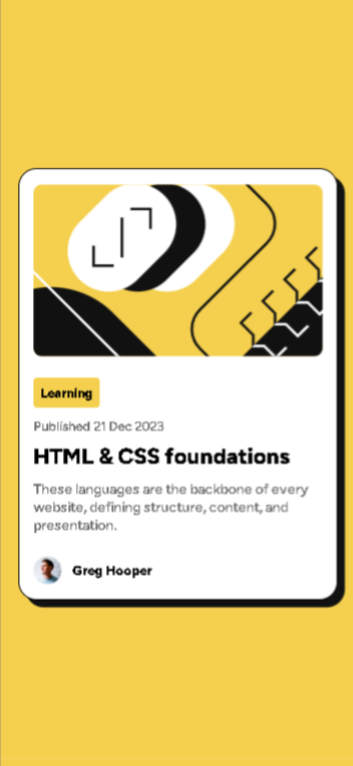
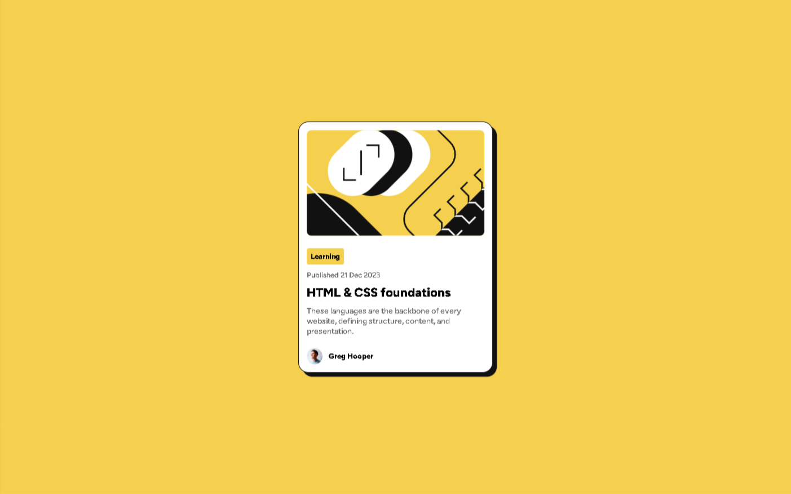
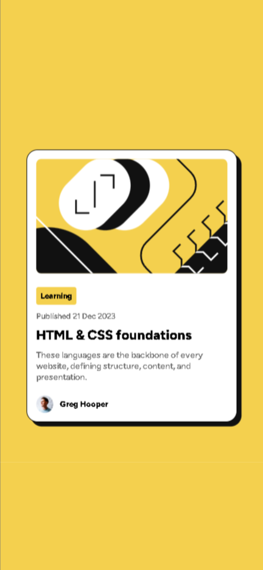

# Frontend Mentor - Solução de cartão de pré-visualização de blog

Esta é uma solução para o [desafio de cartão de pré-visualização de blog no Frontend Mentor](https://www.frontendmentor.io/challenges/blog-preview-card-ckPaj01IcS). Os desafios do Frontend Mentor ajudam você a melhorar suas habilidades de codificação construindo projetos realistas.

## Índice

- [Frontend Mentor - Solução de cartão de pré-visualização de blog](#frontend-mentor---solução-de-cartão-de-pré-visualização-de-blog)
  - [Índice](#índice)
    - [O desafio](#o-desafio)
    - [Captura de tela](#captura-de-tela)
    - [Links](#links)
  - [Meu processo](#meu-processo)
    - [Criado com](#criado-com)
    - [O que aprendi](#o-que-aprendi)
    - [Desenvolvimento contínuo](#desenvolvimento-contínuo)
  - [Autor](#autor)

### O desafio

Os usuários devem ser capazes de:

- Ver a mãozinha de click nos elementos interativos na página.

### Captura de tela






### Links

- URL da solução: [Adicione a URL da solução aqui](https://your-solution-url.com)
- URL do site ativo: [Adicione a URL do site ativo aqui](https://your-live-site-url.com)

## Meu processo

### Criado com

- HTML5
- CSS com Flexbox

### O que aprendi

Descobri como incorporar fontes locais em meus projetos. Basta adicionar este código no CSS:
```css
@font-face {
    font-family: 'Nome-da-Fonte';
    src: url('../fonts/static/Nome-da-Fonte.ttf');
}

.class {
    font-family: 'Nome-da-Fonte', sans-serif;
}
```

### Desenvolvimento contínuo

O próximo passo é focar no aprendizado de React, uma biblioteca JavaScript amplamente utilizada para o desenvolvimento de interfaces de usuário dinâmicas e interativas. Além disso, será fundamental trabalhar com responsividade para garantir que os projetos se adaptem perfeitamente a diferentes tamanhos de tela e dispositivos. Também é importante aprofundar o conhecimento em CSS, especialmente no uso de grid, para criar layouts complexos e flexíveis que melhoram a experiência do usuário.

## Autor

- [GitHub](https://github.com/BeatrizPoncesIP)
- [Frontend Mentor](https://www.frontendmentor.io/profile/BeatrizPoncesIP)